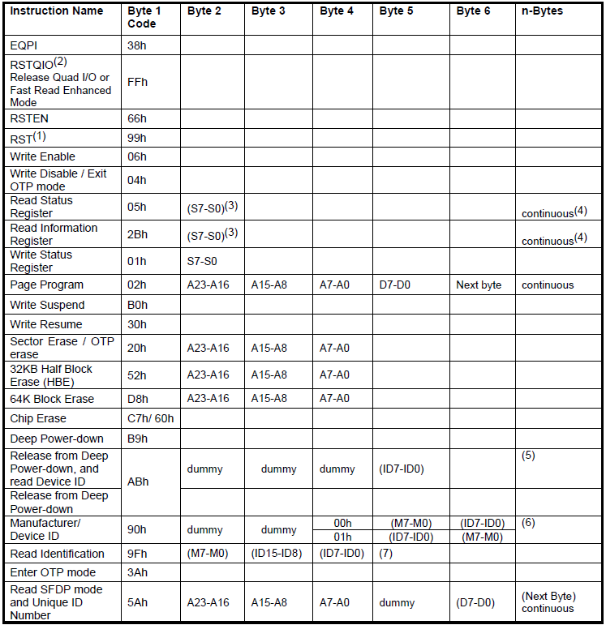
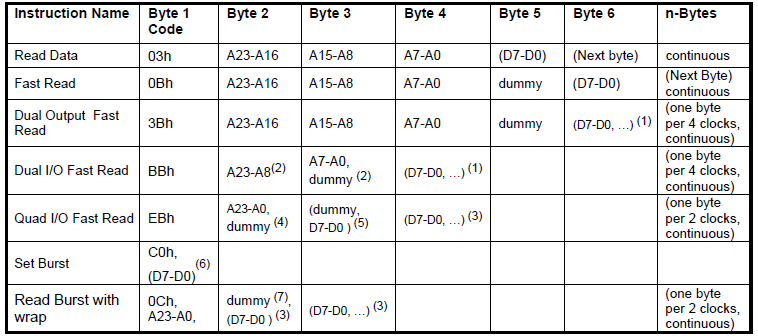
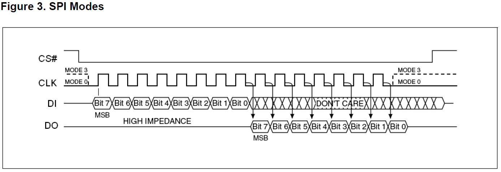
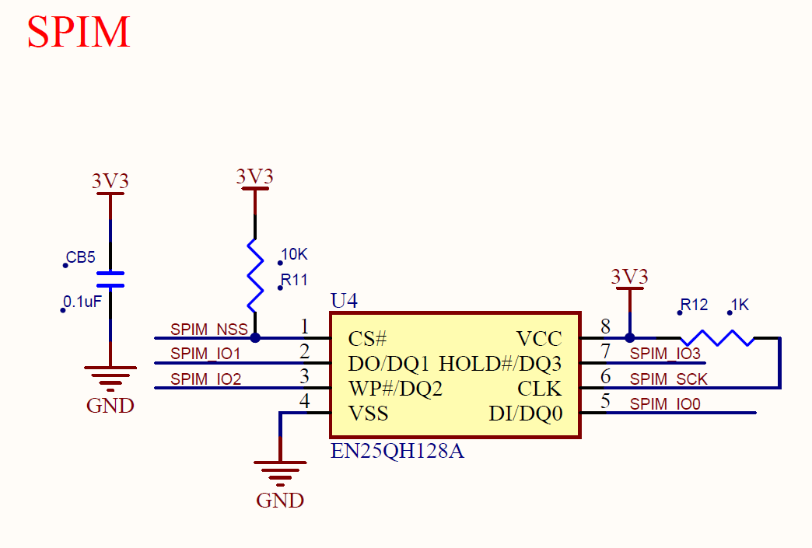
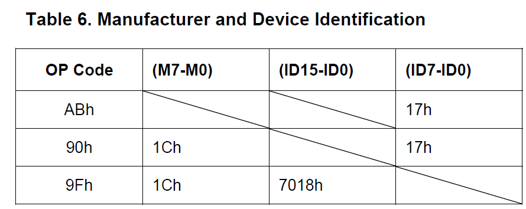
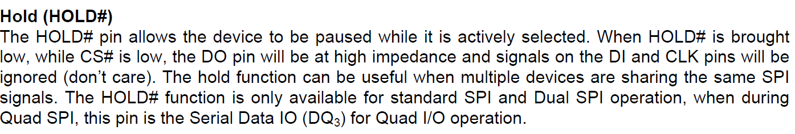
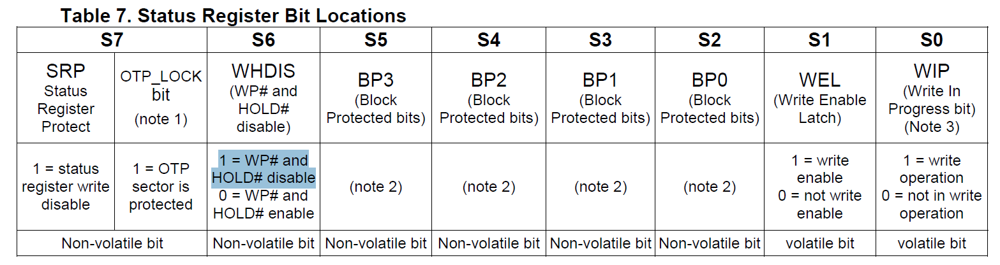
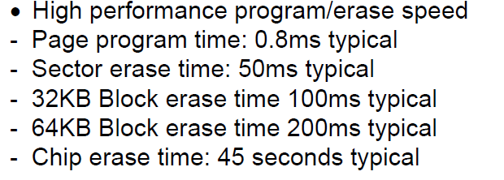
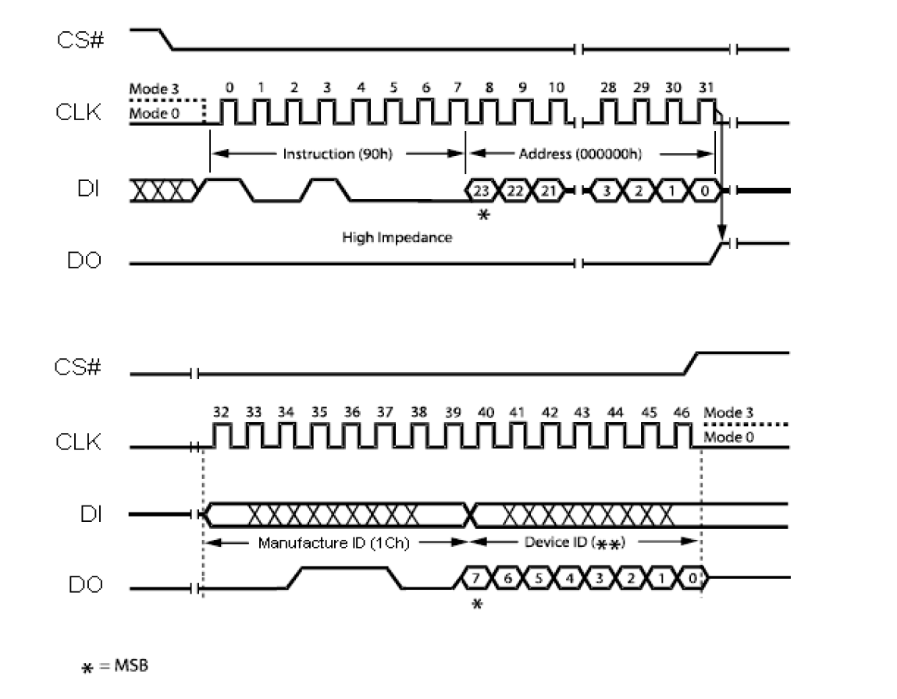

# EN25Q Program

​	EN25QH128A 是串行闪存，支持写保护。支持标准的串行外设接口（SPI)，高性能的双路或四路的输出。SPI时钟频率最高可达104MHz。该闪存在进行写入操作时，使用页操作指令，一次只能写入1到256个字节。

​	该闪存支持对单个页或块或者是全片的擦除操作。可以对每一个内存区域配置写保护模式。每个扇区或块最少能承受10万次的循环擦除操作。

​	该闪存的分布情况：

*  16777216个字节

*  256个块，每个块有64K的大小
*  512个块，每个块有32K的大小
* 4096个扇区，每个扇区有4K的大小
* 65536个页，每个页有256个字节大小

每个页区可以独立操作，每个位可以由1改为0.支持扇区，块，全片擦除，但是不能进行页区擦除。

​	接下来，就是对该闪存的读写擦除操作，它和内部flash的操作大同小异，唯一的区别在于，外部闪存在操作之前，需要先发送一个指令。每一种操作都有对应的指令。这个指令是有厂家自己决定，详细的内容可以去查看厂家的手册。

上面的两张图，就是该闪存芯片的操作指令。根据SPI的通信协议，配合这些指令，我们就可以来操作这块闪存。接下我就把我的写代码的过程写出来。

首先先把思路写出来，通过查看AT32F403的数据手册和电路原理图，我们了解到这块板子上的EN25Q是通过SPIF来进行通信的，但是这块板子上并没有写SPIF的详细信息,RCC寄存器中也没有它的时钟，它映射的四条线也不属于SPI1到SPI4的任何一个。加上我能力有限，所以就没有使用SPIM的线，我使用的是SPI1的通道，使用跳线和EN25Q的四个关键引脚连接起来，进行操作。

通过查看相关的资料，SPIM貌似是一个由硬件来控制的接口，用户只需要使能它的复用功能时钟和外部接口寄存器，就可以使用。具体方式，有待于进一步代码验证。

到这里，通信的方式确定了，接下来就是怎么来配置通信的协议。

提前说一下，我本人在这里吃了一个大亏，就是没有好好看EN25Q的芯片手册。

在此之前，我先把SPI的函数库先修改了一下，让它变的更加通用，而不是单一的只能使用SPI1一个通道。宏的定义也换成官方定义的。但是在第一次最好自己先定义一个宏，有助于加深理解。

首先，先配置SPI1的通道，这里我遇到了下面的几个错误：

* 发送的模式错误，LSM 或者是MSB,它配置错误，导致从设备接收到的信息是错误的

* 时钟相位和时钟极性的配置错误，这两个错误，会导致从设备无法在正确的边沿获取到信息，也无法正确的发送信息。

* 时钟频率的配置，我在一开始，使用的是96MHz的256分频，375KHz，这个频率太低了，最好选择一个大一点的。比如12MHz的频率，96MHz的8分频。只要分频后的频率别超过104MHz就可以。

    其实这两个问题，用一个图就能解释明白，下面我把它复制过来：

    

    由图可以知道，该闪存模块支持MODE0和MODE3两种模式，发送数据的协议是MSB，大端存储。由下面这一句英文：For Mode 0 the CLK signal is normally low. For Mode 3 the CLK signal is normally high. In either case data input on the DI pin is sampled on the rising edge of the CLK. Data output on the DO pin is clocked out on the falling edge of CLK。我们可以知道，数据在下降沿被锁存，上升沿被读取。然后我们通过查看电路图：	我们可以看到，时钟线有被拉高的可能，我们通过查看实际的电路，发现R12被焊上一个电阻。所以时钟线被拉高，也就是说，在空闲状态下，时钟线为高电平，所以这里，我们CPOL（时钟极性）为1，相应的CPHA（时钟相位）也就设置为1，处于MODE3的SPI通信模式。

    ​	到这里我们的SPI配置就结束了，而且我本人在这里也吃了不小的亏，没有好好看芯片手册。接下来，我们先实现第一个功能，读取闪存的ID号。

    ```c
    uint16_t EN25QXXX_readID(SPI_Type *SPIx)
    {
        //chip select low
        //send read instruction
        //send 00h thrice
        //then receive data by send ffh
        uint16_t ret = 0;
        GPIO_PinWrite(HW_GPIOA, gpio_pin_4,0);
        
        spi_RWdata(SPIx, READ_DEVICE_ID);
        spi_RWdata(SPIx, 0X00);
        spi_RWdata(SPIx, 0X00);
        spi_RWdata(SPIx, 0X00);
        
        ret |= (spi_RWdata(SPIx, SEND_DEFAULT_VALUE) << 8);
        ret |= spi_RWdata(SPIx, SEND_DEFAULT_VALUE);
      
        GPIO_PinToggle(HW_GPIOA, gpio_pin_4);
        return ret;
    }
    //这里的READ_DEVICE_ID是一个宏定义，它是一个读设备id号的指令，通过上面的表可以查到。
    //发送的三个0x00,是存放id的地址
    //然后通过发送0xFF，让设备返回id号，第一次返回的是厂家id，第二次返回的是设备的id
    //第二次返回的id号表示闪存的容量
    ```

    

上面这张图是应该返回的结果，如果符合这个表，说明都ID操作正确。

在这里还有一个坑，也是因为我没有仔细看手册，下面我贴出英文说明：



这一段话，说明了HOLD引脚的作用。在硬件上，这个引脚是浮空的，它的状态是未知的，可能是高电平，也可能是低电平。查看上面的英文介绍，当它为低电平，chip select也为低电平时，输出引脚就会变成高阻态，时钟线和输入引脚上的信号会被忽略。所以我们要想使用该闪存，就需要把这个HOLD引脚设置为高电平。解决的办法可以是在硬件上加焊一个1K的电阻，或者是用一个GPIO引脚把它拉到高电平，还有就是软件设置，写入寄存器，将状态寄存器的第六位置1.关闭HOLD。

这个位的下边还标明Non-volatile bit，这是一个掉电不丢失数据的位，也就是说，将他置1之后，只要不重新复位，它一直都是1。在这里，我没有处理这个引脚，导致在读取ID的时候，数据不稳定，能否读出id，完全看运气。我的处理结果就是在硬件上焊接了一个电阻。

好，到这一步，已经能顺利读出ID，而不是之前的完全看运气读。接下来的读写操作就简单了，和操作内部flash的过程是一样，不同的是写入的单位不一样，读取数据，直接对地址进行寻址。写数据，EN25Q的最小写入一个字节，每次写入最多连续写入256个字节。擦除最小范围是一个扇区，扇区大小为4k，支持半块，块，全片的擦除操作。



上面这个图，列出了不同擦除范围所需要的时间。

接下来我把我的代码贴出来：

```c
//initialization EN25Q
void EN25QXXX_init(SPI_Type *SPIx)
{
	uint16_t EN25Q_ID = 0;
    spim_init(SPIx); 
    spi_resetbaud(SPI1,SPI_BAUDRATE_64);
	EN25Q_ID |= EN25QXXX_readID(SPI1);
	printf("EN25Q_ID = [%X]\t\n",EN25Q_ID);
}
void spim_init(SPI_Type *SPIx)
{
    //initialization GPIO   chip select
    GPIO_Init(HW_GPIOA,gpio_pin_4, gpio_speed_50MHz, mode_out_pp);
    GPIO_PinWrite(HW_GPIOA, gpio_pin_4, 1);
    
    
	//initialization SPI1 interface
    SPI_InitType SPI_InitStruct;
			
	SPI_InitStruct.SPI_Transmode = SPI_FULLDUPLEX;
	SPI_InitStruct.SPI_Mode = SPI_CTRL1_MSTEN | SPI_CTRL1_ISS;
	SPI_InitStruct.SPI_FrameSize = SPI_DATASIZE_8Bits;
	SPI_InitStruct.SPI_CPHA = SPI_CTRL1_CPHA;
	SPI_InitStruct.SPI_CPOL = SPI_CTRL1_CPOL;
	SPI_InitStruct.SPI_FirstBit = SPI_FRISTBIT_MSB;
	SPI_InitStruct.SPI_NSSSET = SPI_CTRL1_SWNSSEN;
	SPI_InitStruct.SPI_MCL = SPI_CTRL1_MCLKP;
	SPI_InitStruct.SPI_CPOLY = SPI_CPOLY_RESET;

	spi_init(SPIx,&SPI_InitStruct);
}
```

这是读取id号的操作，只要这个能实现，后续读写操作就容易了。在编写这些功能的时候，需要配合手册上的时序图来进行编写。

```c
uint16_t EN25QXXX_readID(SPI_Type *SPIx)
{
    //chip select low
    //send read instruction
    //send 00h thrice
    //then receive data by send ffh
    uint16_t ret = 0;
    GPIO_PinWrite(HW_GPIOA, gpio_pin_4,0);
    
    spi_RWdata(SPIx, READ_DEVICE_ID);
    spi_RWdata(SPIx, 0X00);
    spi_RWdata(SPIx, 0X00);
    spi_RWdata(SPIx, 0X00);
    
    ret |= (spi_RWdata(SPIx, SEND_DEFAULT_VALUE) << 8);
    ret |= spi_RWdata(SPIx, SEND_DEFAULT_VALUE);
  
    GPIO_PinToggle(HW_GPIOA, gpio_pin_4);
    return ret;
}
```

一定要配合时序图进行编写程序，否则无法正确读取到数据，注意图片的左下角有个星号，写了一个__=MSB__,它表示通信时，发送的数据是从每一个数据的最高位开始发送，大端储存数据。先发送指令，再发送地址，这个期间，输出线没有输出内容，一直是一个高阻态。发送完地址后，主机发送一个字节任意数据，来发起一次传输，这时的从机会返回一个字节数据，通过查看时序图，ID数据会分为两次返回，所以我们需要对返回的数据做合适的处理。最后我们要把chip select线拉高。

后面的写入和擦除操作。也是如此，根据时序图和文字说明，进行合理的编写。需要注意的时，擦除操作时，需要写使能之后，才能进行擦除操作。